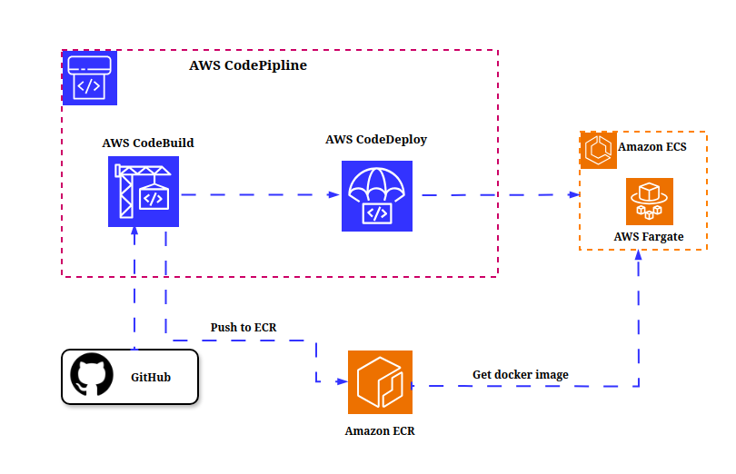

# Sports API 

## **Project Overview**
This project demonstrates how to build and deploy  a containerized SPORTS API AWS. The application uses **Amazon ECR** for storing the container image , **Amazon ECS (Fargate)** for running containers, **Amazon API Gateway** for exposing REST endpoints, and an external **Sports API** for real-time sports data. The project also uses  a CI/CD pipline to  automate the building and deployment  the application. 

The project showcases advanced cloud computing practices, including API management, container orchestration, secure AWS integrations andb uilding CI/CD piplines on AWS .

---

## **Features**
- A REST API for querying real-time sports data
- A containerized backend using Amazon ECS with Fargate
- Scalable and serverless architecture
- API management and routing using Amazon API Gateway
- Automating the building and deployment process. 
 
---

## **Prerequisites**
- **Sports API Key**: Sign up for a free account and subscription & obtain your API Key at serpapi.com
- **AWS Account**: Create an AWS Account Docker & Python
**Basic Knowledge of AWS**: Have basic knowledge and understanding of ECR,ECS, API Gateway,CodeBuild, CodeDeploy and CodePipline.
- **Basic Knowledge of Docker**:Have  some basic knowledge and understanding  of Docker
- **Basic Knowledge of Python**: Have  some basic knowledge Python programming language
- **AWS CLI Installed and Configured**: Install & configure AWS CLI to programatically interact with AWS
- **Serpapi Library**: Install Serpapi library in local environment "pip install google-search-results"
- **Docker CLI and Desktop Installed**: To build & push container images

---

## **Architecture  1**

---

## **Technologies  Services used**
- **Cloud Provider**: AWS
- **Core Services**: Amazon ECS (Fargate), API Gateway, CloudWatch
- **Programming Language**: Python 3.x
- **Containerization**: Docker
- **External API**: Docker

---

## **Section One: Seting Cloud Infracture**
In this first section we will setup and deploy the application manually without using CI/CD
Pipline. 

### **Clone the Repository**
```bash
git clone https://github.com/kodcapsule/Sports-API.git
cd Sports-API 
```
<!-- Creating a Amazon ECR Repo to st -->
### **Create ECR Repo**
The first step is to create a repo on **AMZON ECR** to store our app image
```bash
aws ecr create-repository --repository-name sports-api --region <REGION>
```
Replace the <REGION> with your preferred region. I will be using us-east-1


### **Authenticate and login to Amazon ECR**
```bash
aws ecr get-login-password --region us-east-1 | docker login --username AWS --password-stdin <AWS_ACCOUNT_ID>.dkr.ecr.us-east-1.amazonaws.com

```
Replace the <AWS_ACCOUNT_ID> with  your account id

### **Build and Push the Docker Image to Amazon ECR**
```bash
docker build --platform linux/amd64 -t sports-api .
docker tag sports-api:latest <AWS_ACCOUNT_ID>.dkr.ecr.<REGION>.amazonaws.com/sports-api:sports-api-latest
docker push <AWS_ACCOUNT_ID>.dkr.ecr.<REGION>.amazonaws.com/sports-api:sports-api-latest
```
Replace the <AWS_ACCOUNT_ID> and <REGION> with  your account id and the region where you created your ECR repo

### **Creating  ECS Cluster with Fargate**
#### Step 1. Create an ECS Cluster:
- Go to the ECS Console → Clusters → Create Cluster
- Name your Cluster (sports-api-cluster)
- For Infrastructure, select Fargate, then create Cluster

#### Step 2. Create a Task Definition:
- Go to Task Definitions → Create New Task Definition
- Name your task definition (sports-api-task)
- For Infrastructure, select Fargate
- Add the container:
  - Name your container (sports-api-container)
  - Image URI: <AWS_ACCOUNT_ID>.dkr.ecr.<REGION> amazonaws.com/sports-api:sports-api-latest
  - Container Port: 8080
  - Protocol: TCP
  - Port Name: Leave Blank
  - App Protocol: HTTP
- Define Environment Eariables:
  - Key: SPORTS_API_KEY
  - Value: <YOUR_SPORTSDATA.IO_API_KEY>
  - Create task definition

#### Step 3. Run the Service with an ALB
- Go to Clusters → Select Cluster → Service → Create.
- Capacity provider: Fargate
- Select Deployment configuration family (sports-api-task)
- Name your service (sports-api-service)
- Desired tasks: 2
- Networking: Create new security group
- Networking Configuration:
  - Type: All TCP
  - Source: Anywhere
- Load Balancing: Select Application Load Balancer (ALB).
- ALB Configuration:
 - Create a new ALB:
 - Name: sports-api-alb
 - Target Group health check path: "/sports"
 - Create service

#### Step 4. Test the ALB:
- After deploying the ECS service, note the DNS name of the ALB (e.g., sports-api-alb-<AWS_ACCOUNT_ID>.<REGION> elb.amazonaws.com)
- Confirm the API is accessible by visiting the ALB DNS name in your browser and adding /sports at end (e.g, http://sports-api-alb-<AWS_ACCOUNT_ID>.<REGION> .elb.amazonaws.com/sports)

### **Configure API Gateway**
#### Step 1. Create a New REST API:
- Go to API Gateway Console → Create API → REST API
- Name the API (e.g., Sports API Gateway)

####  2. Set Up Integration:
- Create a resource /sports
- Create a GET method
- Choose HTTP Proxy as the integration type
- Enter the DNS name of the ALB that includes "/sports" (e.g. http://sports-api-alb-<AWS_ACCOUNT_ID>.us-east-1.elb.amazonaws.com/sports

#### 3. Deploy the API:
- Deploy the API to a stage (e.g., prod)
- Note the endpoint URL

### **Test the System**
- Use curl or a browser to test:
```bash
curl https://<api-gateway-id>.execute-api.us-east-1.amazonaws.com/prod/sports
```
## **Section Two: Setting a CI/CD Pipline**
In this second section , we will setup a CI/CD pipline to automate the building and deployment of the containerized application on **Amazon ECS (Fargate)** using AWS services like **AWS CodeBuild** , **AWS CodeDeploy** and **AWS CodePipline**


## **Architecture  2**


### **Create a buildspec.yml file**


### **Create a CodeBuild Project**

### **Create a CodeDeploy Project**

### **Create a CodePipline**

### **Future Improvements**
- Add caching for frequent API requests using Amazon ElastiCache
- Add DynamoDB to store user-specific queries and preferences
- Secure the API Gateway using an API key or IAM-based authentication
- Add a FrontEnd/UI 
- Use Terraform to build cloud Infracture Add 


